**Kevin Kang (A17230649)**
==========================
**Lab Report #1**
--------------------------
> **Installing** ***VSCode***
* Go to the **Visual Studio Code** website: (https://code.visualstudio.com/)
* Download and install it on your computer **(Choose your *OS*)**
* Once it is installed, you should be able to open a window like this: 
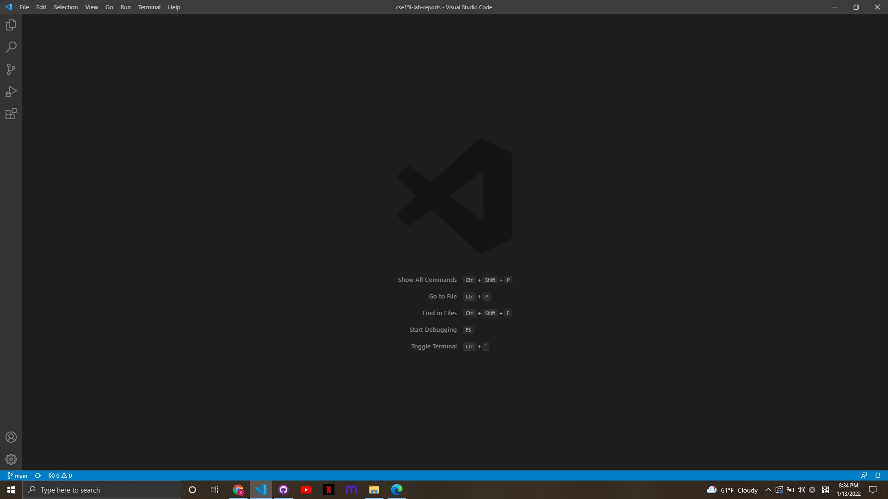

> **Remotely Connecting**
* If you use **Windows**, you **MUST** install a program called **OpenSSH**: https://docs.microsoft.com/en-us/windows-server/administration/openssh/openssh_install_firstuse
* Search your course-specific account for CSE15L and **RESET** your password for that account here: https://sdacs.ucsd.edu/~icc/index.php
* The reset can take anywhere **from 1 minute to 20 minutes** to start working, so please be patient. Your lab account should look like this format: **cs15lwi22zz@ieng6.ucsd.edu** (replace **"zz"** with the letters in yours)
* Open a terminal in the **VSCode** (Ctrl or Command + **`**, or use the **Terminal → New Terminal menu option**).
* Type **ssh cs15lwi22zz@ieng6.ucsd.edu** on the terminal (Replace "zz" with the letters in yours)
* Since this is your first time, you likely get a warning message like this: 
The authenticity of host 'ieng6.ucsd.edu (128.54.70.227)' can't be established.
RSA key fingerprint is SHA256:ksruYwhnYH+sySHnHAtLUHngrPEyZTDl/1x99wUQcec.
Are you sure you want to continue connecting (yes/no/[fingerprint])?
* Type **yes**, then enter your password
* Once you are logged in, you shoud see something like this:
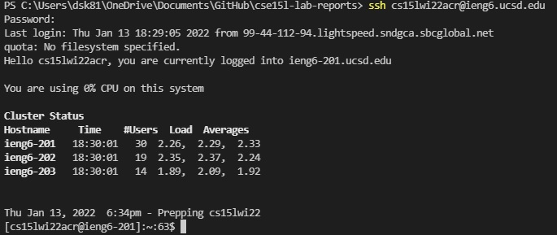

> **Trying Some Commands**
* Try some commands both on your computer and remote server(after ssh-ing): **cd**, **ls**, **pwd**, **mkdir**
  1. cd ~
  2. cd
  3. ls -lat
  4. ls -a
  5. ls <directory> where <directory> is /home/linux/ieng6/cs15lwi22/cs15lwi22abc, where the abc is one of the other group members’ username
  6. cp /home/linux/ieng6/cs15lwi22/public/hello.txt ~/
  7. cat /home/linux/ieng6/cs15lwi22/public/hello.txt
* On your computer:
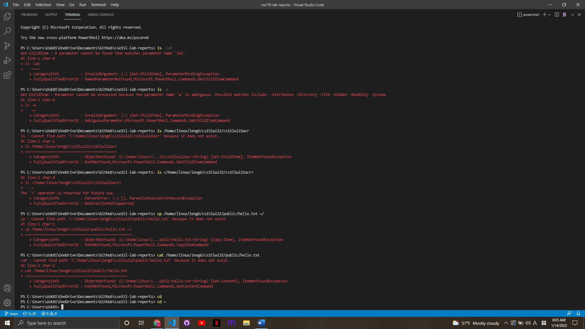

* On the remote server(after ssh-ing):
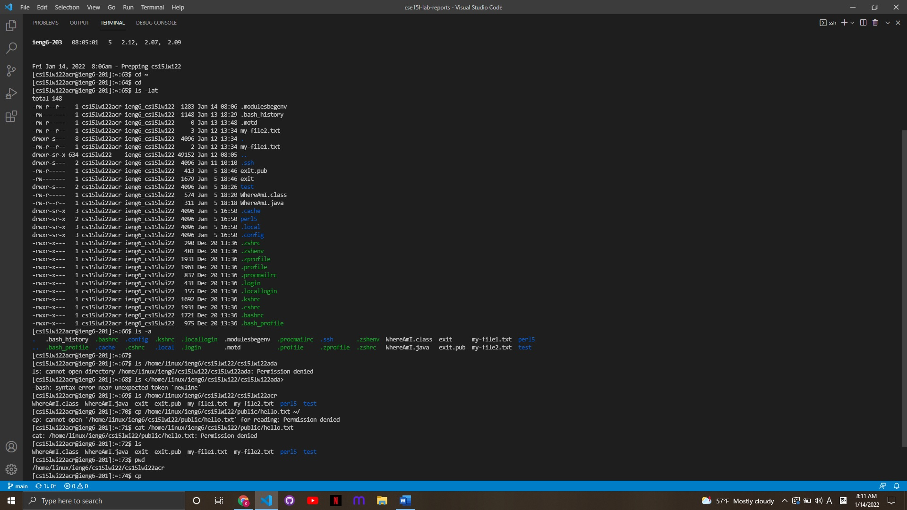
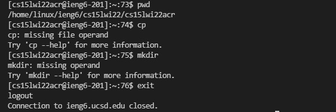

> **Moving Files with scp**
* Create a file on your computer called **WhereAmI.java** and put the following contents into it:
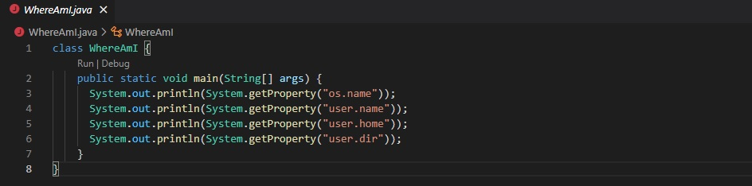
  
* Run it using javac and java on your computer:
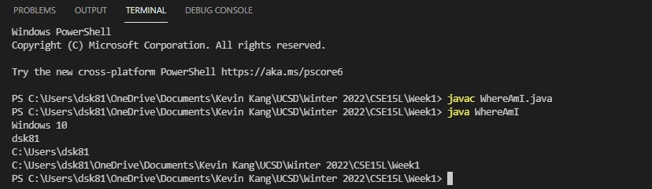
  
* Then, in the terminal from the directory where you made this file, run this command (as usually, using your username): 

  **scp WhereAmI.java cs15lwi22zz@ieng6.ucsd.edu:~/**
  
  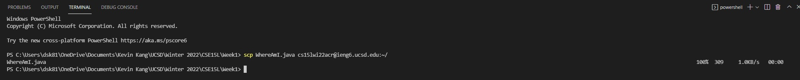

* Lastly, log into **ieng6** with **ssh** again, and use **ls**. You should see the file there in your home directory:
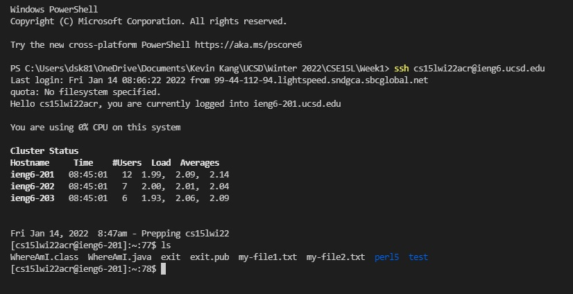

* Now you can run it on the **ieng6** computer using **javac** and **java** :)  
>**Setting an SSH Key**
* Set up SSH keys on your computer:
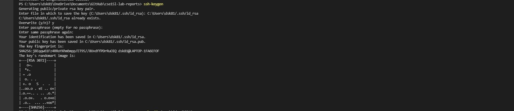
  
* If you're using **Windows**, you must run Command Prompt as **administrators** and follow these steps:
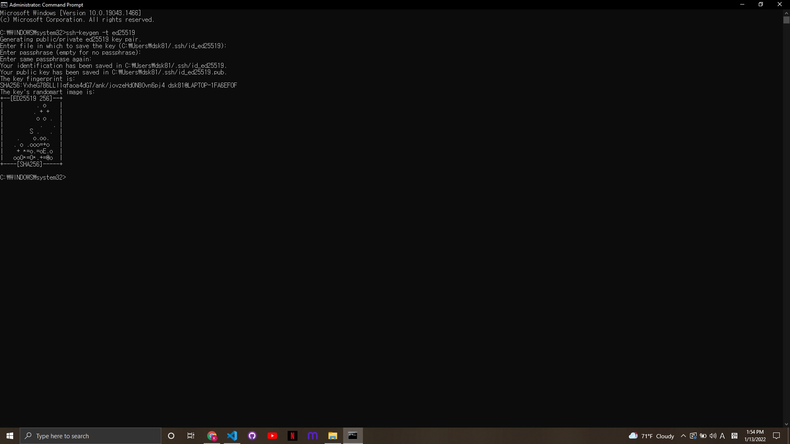

* Only for the **Windows** users, follow the extra **ssh-add** steps:
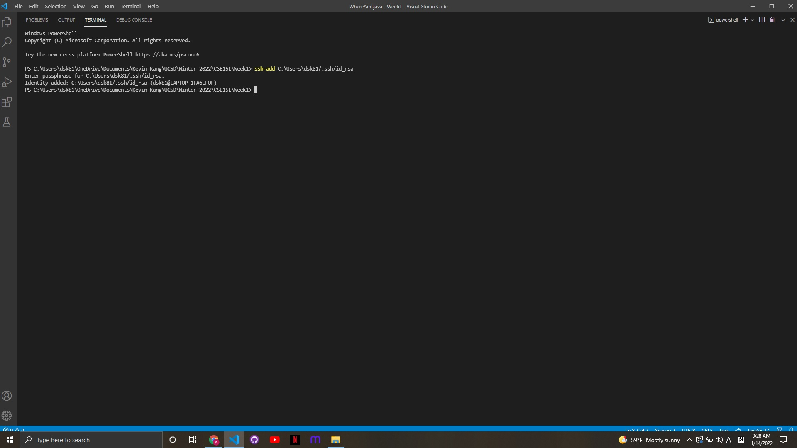
  
* Then, copy the public (not the private) key to the **.ssh** directory of your user account on the server:
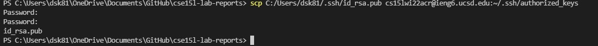

* Now, you should be able to **ssh** or **scp** from this client to the server without entering your password.
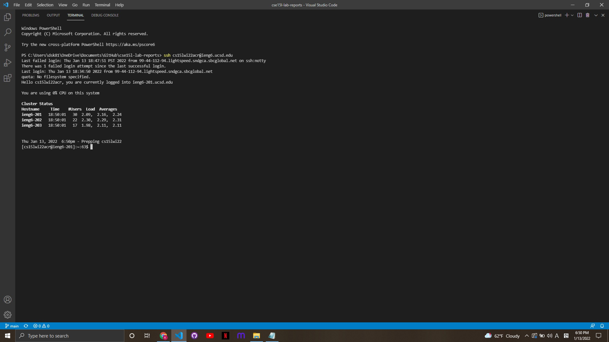
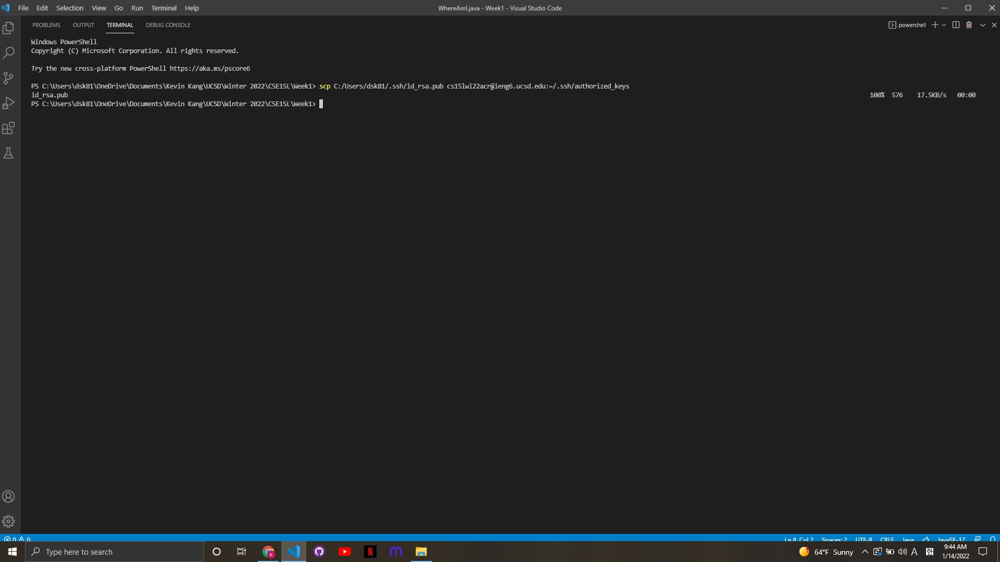

>**Optimizing Remote Running**
* Make a ***local edit*** to **WhereAmI.java** (On your computer):
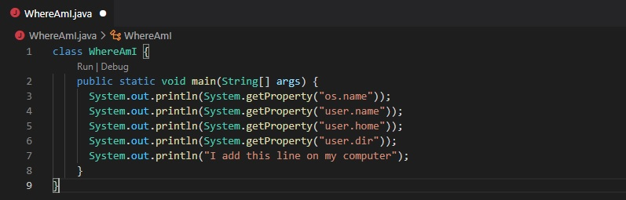

* Compile a file on your local computer
* Copy a file to the remote server
* Compile and run a file on the remote server:
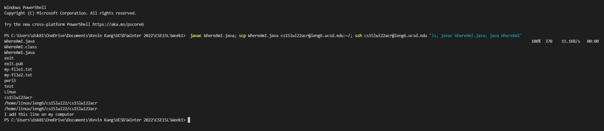
