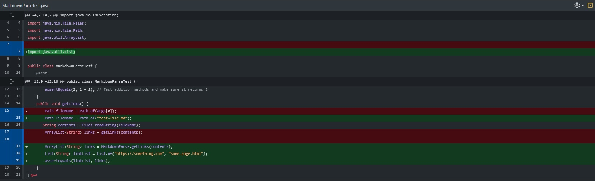

# Lab Report 2: When Tests Accumulate

## **Implementation of First Test**


[Error-Causing Test1](https://github.com/KXVlNY/markdown-parse/commit/491fedb66d3d9288a52c1fb68ce2626ebdc6445e)

### **Output/Symptom of the Error:**
```
-1
Current index is: 36
-1
Current index is: 36
-1
Current index is: 36
# ... infinite loop

```

In this first example, **underlying bug was detected by the symptoms of the failure-inducing input**. 

In other words, the only way to detect if there was an underlying problem in the code was to first check if such problem-inducing inputs can cause an issue, where in this case the infinite loop between `-1` and `Current index is: 36` was the resulting symptom from that input. 

It shows that there is an underlying issue *(a bug!)* with the code that causes these symptoms.
***

## **Implementation of Second Test**



[Error-Causing Test2](https://github.com/KXVlNY/markdown-parse/commit/41d634f0afecf7263cce77f26aaa640fc9871ba2)

### **Output/Symptom of the Error:**

```
PS C:\Users\dsk81\OneDrive\Documents\GitHub\markdown-parse> javac -cp ".;lib\junit-4.13.2.jar;lib\hamcrest-core-1.3.jar" MarkdownParseTest.java
MarkdownParseTest.java:16: error: unreported exception IOException; must be caught or declared to be thrown
            String contents = Files.readString(fileName);
                                              ^
1 error

```

In this second example, the JUnit tester was implemented in order to improve efficiency with testing, and tried to use the markdown files as the test. *However, implemented the tester ended up being part of one of the tests as well.* **In attempt to fix our bug, we found another bug!**

The bug's symptoms were indicated by the error messages caused by implementing those testing methods, saying that those methods must be caught/thrown. As a result, the bug was then detected *(we did not throw IOException for the method)*.

***
