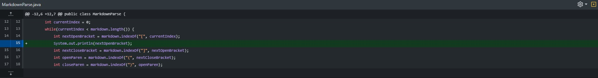

# Lab Report 2: When Tests Accumulate

## **Implementation of First Test**


[Error-Causing Test](https://github.com/KXVlNY/markdown-parse/commit/491fedb66d3d9288a52c1fb68ce2626ebdc6445e)

### **Output/Symptom of the Error:**
```
-1
Current index is: 36
-1
Current index is: 36
-1
Current index is: 36
# ... infinite loop

```
