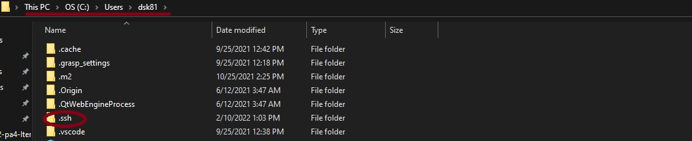
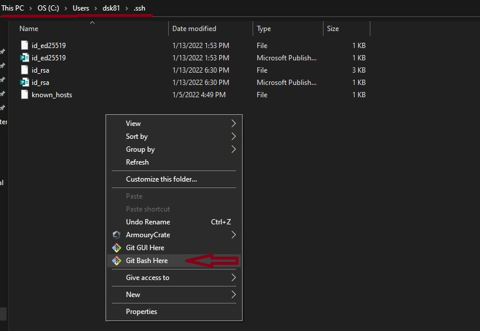
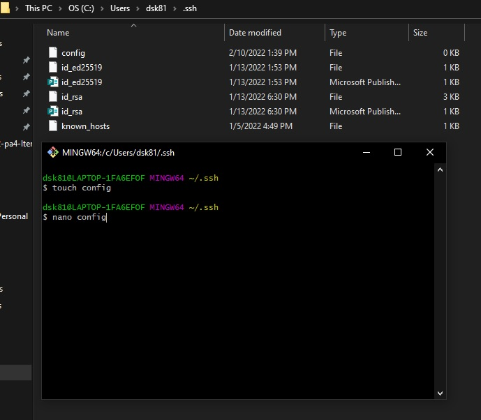
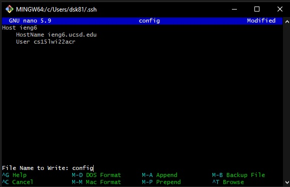
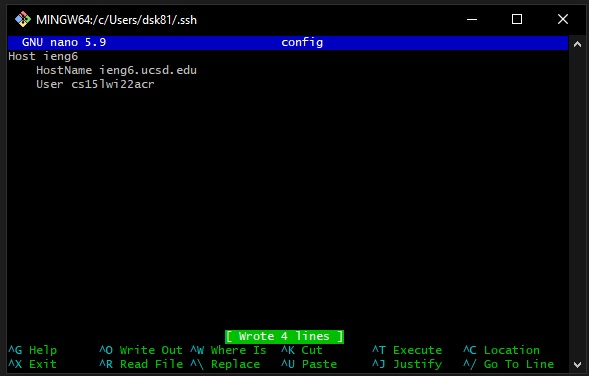
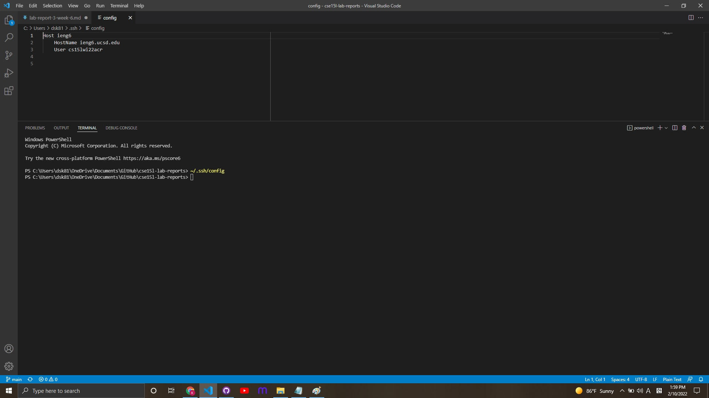
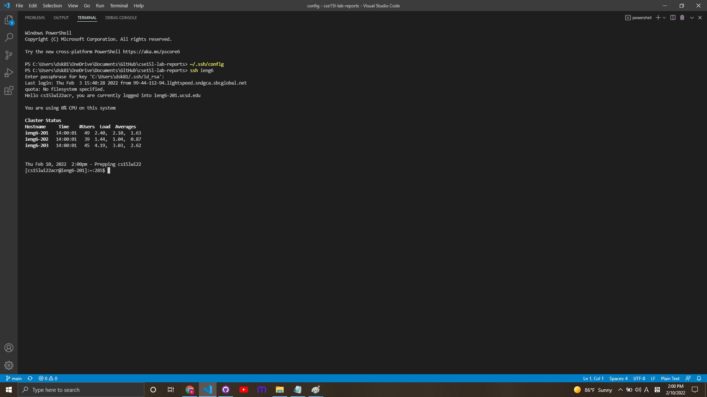
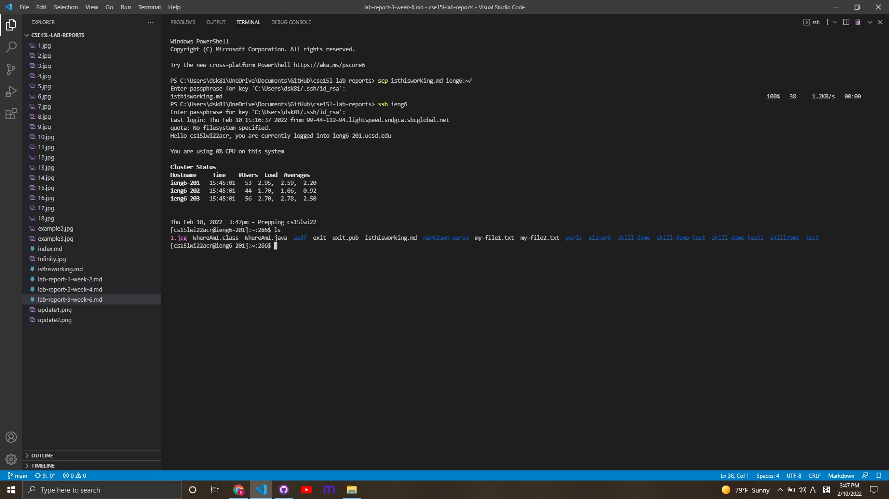

# Lab Report 3: Streamlining `ssh` Configuration

## Setting Up `./ssh config` by Using the Git Bash

**This instruction is for **Windows machines ONLY****

Generally, in Windows machine, the SSH config file stored in the following location: 
`/C/Users/PC_USER_NAME/.ssh/` 

Go to the `.ssh` directory `/C/Users/PC_USER_NAME/.ssh/`, 
click right mouse button and choose **"Git Bash Here"**

Create a file named "config" with the following command:
`touch config`

Now open the config file with the command:
`nano config`

Now write the following lines inside the config file:

**Replace `cs15lwi22acr` with YOUR username**

Save the config file with the command: Ctrl-o

Then, press enter

Now try opening `~/.ssh/config` on your computer
(I opened it with a VSCode)

### Logging into `ieng6` Account by Using `ssh ieng6`

Now we can use `ssh ieng6` that’s faster and easier to type!

#### Copying a File by Using `scp` Command

Now we can copy a local file to the remote server with the command: `scp isthisworking.md ieng6:~/`

