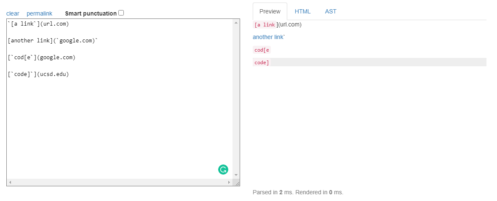
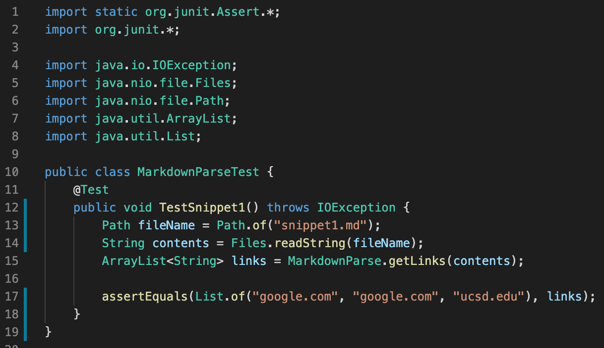
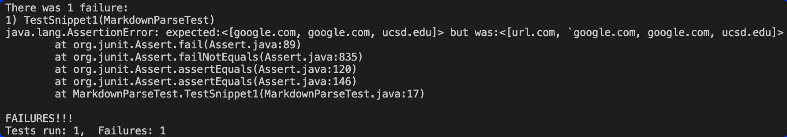
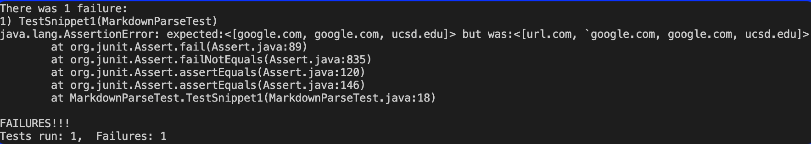
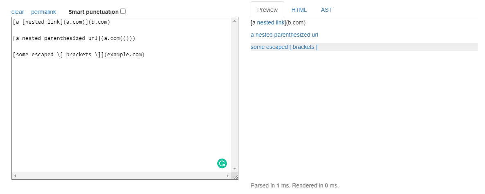
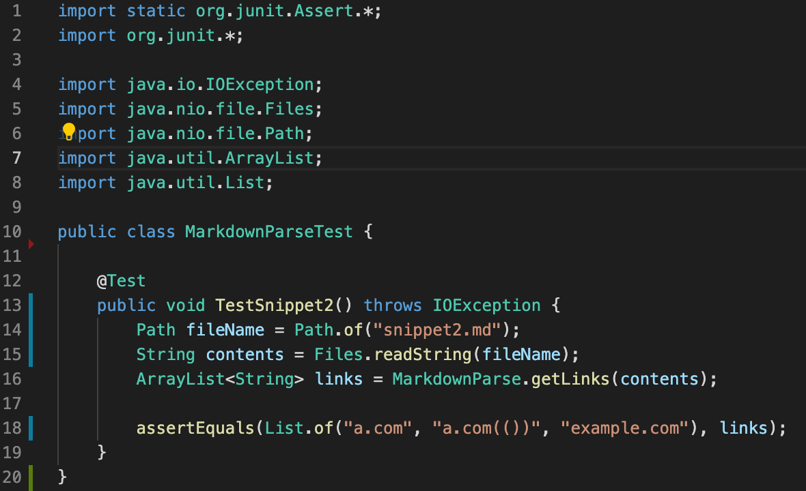
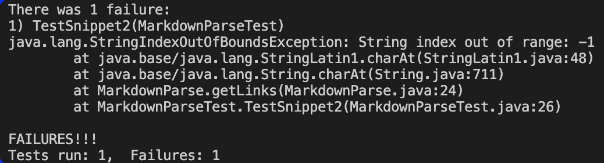
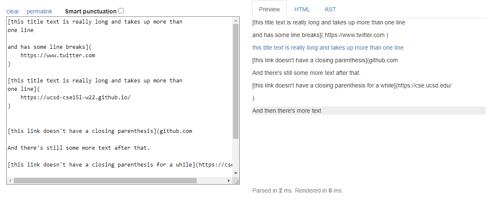
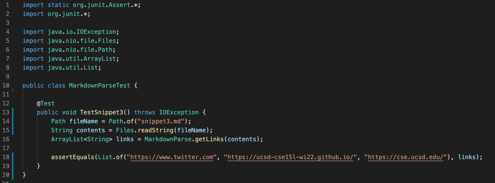
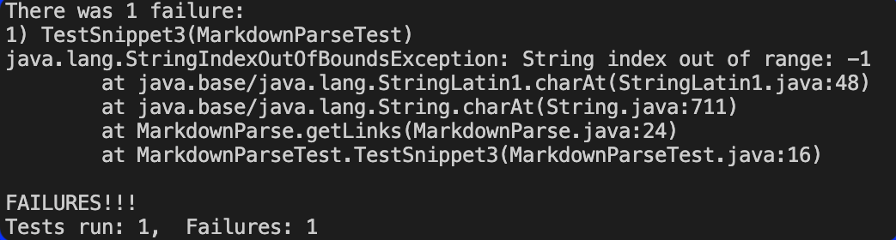

# Lab Report 4

Link to my `markdown-parse` repository: [My Repository](https://github.com/KXVlNY/markdown-parse)

Link to `markdown-parse` repository that I reviewed: [Reviewed Repository](https://github.com/TheZenMasterz/markdown-parse)

---

## **Snippet 1**

**Snippet 1** should produce 3 links, with the first line not being a link as shown in the preview:

My code in `MarkdownParseTest.java` to test **Snippet 1**:

### *My Implementation*

Output from running JUnit test:

*The test failed

### *Reviewed Implementation*

Output from running JUnit test:

*The test failed

---

## **Snippet 2**

**Snippet 2** should produce 3 links, with the attempted `b.com` not being a link as shown in the preview:

My code in `MarkdownParseTest.java` to test **Snippet 2**:

### *My Implementation*

Output from running JUnit test:

*The test failed

### *Reviewed Implementation*

Output from running JUnit test:

*The test failed

---

## **Snippet 3**

**Snippet 3** should produce only 3 links and text as shown in the preview:

My code in `MarkdownParseTest.java` to test **Snippet 3**:

### *My Implementation*

Output from running JUnit test:

*The test failed

### *Reviewed Implementation*

Output from running JUnit test:

*The test failed

---

## **Questions**

### **Question for Snippet 1**

I believe that there is a small, less than 10 line, code change that will make my code work for Snippet 1 and any related cases that use inline code with backticks. The code change would scan for backticks in the file and ensure that they are disregarded by skipping them. This would ensure that even if backticks exist in the file, the `MarkdownParse.java` would move past them instead of including them in the ArrayList of links made in the `getLinks` method.

### **Question for Snippet 2**

I believe that there is a small, less than 10 line, code change that will make my code work for Snippet 2 and all related cases that nest parentheses, brackets, and escaped brackets. I would change my code to add an implementation that when there is an opening parenthese, bracket, or escaped brackets, anything between the first instance of the opening symbol and the last instance of the closing symbol is included in the ArrayList of links made in the `getLinks` method. This would ensure that my code produces `a.com(())` instead of `a.com((` in the ArrayList of links. 

### **Question for Snippet 3**

I disagree that there is a small, less than 10 line, code change that will make my code work for Snippet 3 and all related cases that have newlines in brackets and parentheses. Since checking for new lines will require more lines than the code that will move past backticks (revise for Snippet 1) or the code that will include anything between the first instance of the opening symbol to the last instance of the closing symbol (revise for Snippet 2). Moreover, there could be multiple new lines which I would have to take into consideration for fixing the code to ensure that all the JUnit tests for Snippet 3 passed. 
