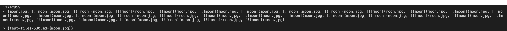
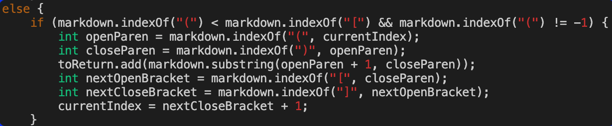

# Week 10: Lab report 5 

## How I Found the Tests with Different Results

To find the tests with different results, I used a bash script to print the results onto a results text file for each parser, and then used `diff` to compare the results of each markdown parser. In particular, I run:

```bash
diff -u my-result.txt other-result.txt
```

The result would look like this

```bash
--- my_results.txt      2022-03-10 11:48:49.357747200 -0800
+++ other_results.txt   2022-03-10 11:50:04.441919000 -0800
@@ -209,7 +209,7 @@
 test-files/193.md
 []
 test-files/194.md
-[]
+[url]
 test-files/195.md
 []
 test-files/196.md
@@ -227,7 +227,7 @@
 test-files/200.md
 []
 test-files/201.md
-[]
+[baz]
 test-files/202.md
 []
 test-files/203.md
@@ -539,7 +539,7 @@
 test-files/341.md
 []
 test-files/342.md
-[]
+[/foo`]
 test-files/343.md
 []
 test-files/344.md
```

From this, I can see there are difference in the result in test file `194.md`

## Test 1: `194.md`

This is the content of the file itself

```markdown
[foo*bar\]]: my_(url) "title (with parens)"

[Foo*bar\]]
```

My group implementation output

```bash
[]
```

Lab 9 implementation output

```bash
[url]
```

The correct answer should be

```bash
[title (with parens)]
```

So both implementation are incorrect. I think I need to watch out for special case of what is considered to be link. In particular, the part I have to fix is:

```java
final String regex = "(?<!!)(?<!`)\\[(?>[[a-zA-Z0-9 ]&&[^\\n]])+\\]\\((\\S+)\\)";
```

## Test 2: `530.md`

While my implementation caused the wrong output, the lab 9 implementation presented the expected output. The expected output is to provide the link `moon.jpg`:


Output when running `diff` at file `530.md`:



The bug in my implementation that causes the wrong output is that my code does not use the closing parenthese to advance the `currentIndex` variable when it sees that the opening parenthese comes before an opening bracket. Instead it uses the closing bracket to advance the `currentIndex` under this condition; therefore causing the wrong output. This is why the output shows multiple `![moon](moon.jpg,` after properly showing just `moon.jpg`. This is because the `currentIndex` is restarted back at the beginning of the line and copies everything between the opening bracket and closing bracket. 

Image of the code that needs to be fixed:



---
